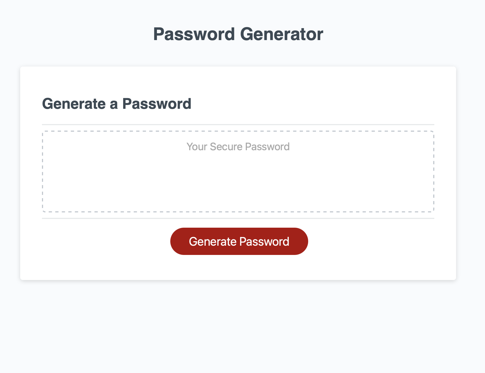
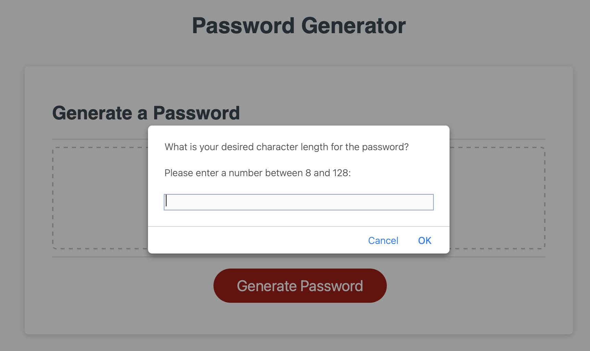
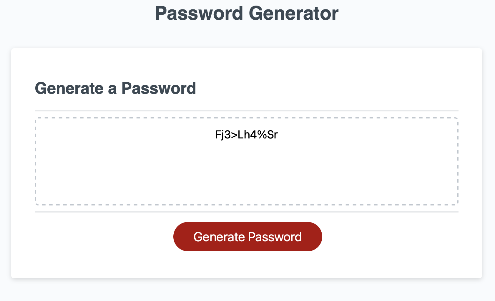

# Password-Generator
This is a simple application that will take a series of user inputs and generate a random password. 

## How does this application work?
**Below is the step-by-step algorithm for this application:**

1. The user opens the application using the Live URL link ()

2. The user clicks the button that says "Generate Password"
    - If the user does not enter a number between 8-128 characters, they will receive an error message
    - The error message appears if they enter NOT a number, or if they enter a number <8 or >128
    - If the user clicks CANCEL or enters nothing and clicks OK, they will go back to the start

3. The user then clicks through 4 prompts to determine if they want their password to include:
    - Uppercase Characters
    - Lowercase Characters
    - Numerical Values
    - Special Characters

4. If the user does not select any of the 4 available character types (by clicking "Cancel" on every prompt), they will receive an error alert and start over

5. The application will generate a password that matches the length and characters selected by the user. This password will be displayed in the body's Textarea element.

## Accessing the application
Below are the links to the live application (.io URL) and the link to the Github Repo.

**Live URL:** https://bckasper.github.io/Password-Generator/ 

**Github Repo:** https://github.com/bckasper/Password-Generator 

## Screenshots

